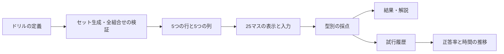

# MathLoop「25マス計算」全体設計

作成日：2026-09-12  
状態：初期拡張を実装済み（2026-09-12）。以下は合意した全体設計を残したもの。「現在」「拡張案」は設計時点を指す。

実装済み：共通計算表、5カテゴリ・14演算・240セット、幾何5種類、練習／計測、係数入力・厳密多項式採点、初回回答と最終回答の分離、誤答復習、履歴・統計・JSON入出力、旧記録移行。追加演算は基礎／標準各10セット。ベクトル・行列は2〜3成分、多項式は有限範囲に限定している。高度な構造ドリルなど、以下にある将来候補は引き続き拡張対象。

2026-09-13追記：7演算（常微分方程式、リーブラケット、計量と内積、クリストッフェル記号、接ベクトルと微分、テイラー展開、複素解析）各20セットと、全21項目の基本ガイドを追加。合計380セット。計測中のガイドは非表示。

## 1. 目指すもの

**25マス計算を、数学の基礎計算・記号操作を滑らかに行うための反復ドリルにする。**

利用者向けの名称は「25マス計算」を維持する。説明文は「数から微分形式まで。25回の反復で、数学の基本操作を身につける。」を案とする。

基本単位は **5つの行データ × 5つの列データ → 25個の答え**。数字、関数、ベクトル、写像、微分形式を同じ画面で扱えるようにする。既存の問題一覧・テーマ演習は、まとまった思考や証明を練習する場として継続する。

最初の優先目標は「速さ」より「正確さと反復」。速度比較は同じ演算・難度・入力方法の中で行う。

## 2. 現在の機能と拡張範囲

| 項目 | 現在 | 拡張案 |
| --- | --- | --- |
| 問題 | 整数加算・整数乗算・分数加算・複素数乗算、各10セット | 5カテゴリに整理し、演算ごとにセットを追加 |
| 表 | 数値を縦横に置く5×5 | 対象×対象、対象×操作、対象×パラメータ |
| 答え | 文字入力。数値・分数・複素数を判定 | 数、式、ベクトル、行列、集合、微分形式を型別に判定 |
| 採点 | 25問まとめて採点 | 練習と計測を分け、構文エラーも区別 |
| 記録 | 各セットの入力と直近の結果をブラウザ保存 | 試行履歴を蓄積し、正答率と時間の推移を表示 |
| 再挑戦 | 同じ問題を解き直す | 同じセット・新しいセット・誤答復習 |

既存の問題番号、出題内容、保存キーを引き継ぐ。旧記録から、当時保存していなかったセル別時間や初回正答率は推定しない。

## 3. カテゴリと問題形式

学習画面は日本語を主表示とし、英語名を補助に使う。まずカテゴリを選び、その中で演算を選ぶ。

| カテゴリ | 演算候補 | 行 × 列 | 各マスの答え |
| --- | --- | --- | --- |
| 計算 / Calculation | 四則、分数、べき、根号、複素数 | 数 × 数・指数 | 数または簡単な式 |
| 代数 / Algebra | 多項式の和と積、内積、行列積、線形写像、置換 | 多項式×多項式、ベクトル×ベクトル、写像×対象 | 多項式・数・ベクトル |
| 解析 / Analysis | 微分、定積分、極限、Taylor係数、基本対数 | 関数×微分回数・区間・極限点・次数、底×真数 | 式または数 |
| 構造 / Structures | mod、gcd、集合、論理、群、離散確率 | 整数×整数、集合×集合、命題×命題、群要素×群要素 | 数・集合・真理値・群要素 |
| 幾何 / Geometry Drill | 形式の評価、wedge積、df、外微分、pullback、計量 | 形式×ベクトル、形式×形式、対象×パラメータ、写像×形式 | 数・関数・微分形式 |

### 出題上の約束

- 左の行データを第1引数、上の列データを第2引数とする。減算、除算、wedge積、置換の合成は、順序を表の上にも明記する。
- 1セットで演算・答えの型・前提条件を統一する。微分と点への代入を同じ表の列に混ぜる形式は、初期版では採用しない。
- 対数は底が正かつ1以外、真数は正とする。実数範囲の根号や分母についても、全25組で定義できることを生成時に検査する。
- 極限は両側・左側・右側を指定し、「存在しない」「発散」を答えに含める場合は、その区別をセットで教える。
- 群の5×5表は、5要素の群なら完全なCayley表になる。より大きな群から5要素ずつ選ぶ場合は「演算表の一部」と表示し、結果が見出しにないことを許す。
- 論理の真理値そのものは2種類なので、5×5にするなら共通の真理値割当ての下で異なる5命題を使う。確率は標本空間と分布をセット全体で固定する。
- 因数分解は「式×式」にはなりにくい。パラメータつきの式を使うか、後述の短問モードに置く。

## 4. 25マスを作る3つの型

| 型 | 意味 | 例 |
| --- | --- | --- |
| 対象 × 対象 | 2つの対象に同じ演算を行う | 内積、wedge積、集合の共通部分 |
| 対象 × 操作 | 対象に、列で指定された同系列の操作を行う | 関数×1〜5階微分、関数×積分区間 |
| 対象 × パラメータ | 行の式・形式に列の値を入れてから演算する | 関数族 f_a の df、形式族 ω_a の dω_a |

`df` や外微分 `d` は一項演算なので、同じ対象に同じ演算を5回繰り返す列を作らない。パラメータや評価点を使って25個の異なる問題にする。

「点 p での df」を扱う場合は **微分してから p に代入** する。先に関数を定数化して微分する問題と混同しない。

## 5. Geometry Drill：最初の5種類

### G1. 1形式をベクトルに作用させる

**行：1形式 ω、列：ベクトル X、答え：ω(X)。**

最初は共通の座標空間 R³ 上の定数係数を使う。

行の例：`dx, dy, dz, 2dx-dy, dx+dy+dz`  
列の例：`∂x, ∂y, ∂z, 3∂x+∂y, ∂x-2∂y+∂z`

例：`(2dx-dy)(3∂x+∂y)=5`。

入力は数値1個。基底と双対基底の組合せを覚えた後、係数が関数の形式・ベクトル場へ進み、答えを関数に拡張する。点でのベクトルとベクトル場は問題表示で区別する。

### G2. wedge積

**行：α、列：β、答え：α∧β。**

R³ の座標順序を `(x,y,z)`、2形式の基底順序を `(dx∧dy, dx∧dz, dy∧dz)` と固定する。

最初のセットでは、縦横ともに次の5形式を使える。

| α∧β | dx | dy | dz | dx+dy | dy+dz |
| --- | --- | --- | --- | --- | --- |
| dx | □ | □ | □ | □ | □ |
| dy | □ | □ | □ | □ | □ |
| dz | □ | □ | □ | □ | □ |
| dx+dy | □ | □ | □ | □ | □ |
| dy+dz | □ | □ | □ | □ | □ |

例：`(dx+dy)∧(dy+dz)=dx∧dy+dx∧dz+dy∧dz`。

対角成分の零と、行列の対角を挟んだ符号反転に意味があるので、このセットでは対称な配置を意図的に残す。計測用の別セットでは行・列の並びを独立に変更する。

### G3. 関数の微分 df

**行：パラメータつき関数 f_a、列：定数 a、答え：d_{x,y}f_a。**

行の例：`x²+ay, x²y+a xy, ax²+y², x³+ay², (x+ay)²`  
列の例：`a=-2,-1,0,1,2`

例：`f_a=x²y+a xy`、`a=2` のとき、

`df=(2xy+2y)dx+(x²+2x)dy`。

**aは微分する変数ではなく定数**と明記する。基本入力はdx、dyの係数をそれぞれ書く方式。続くセットでR³、点における微分、`df(X)=Xf`を扱う。

### G4. 外微分 dω

**行：パラメータつき1形式 ω_a、列：定数 a、答え：dω_a。**

初級はR²の多項式係数1形式。`ω=P dx+Q dy`に対して、答えを`dx∧dy`の係数1個に整理する。中級でR³の2形式を答える。

例：R³で `ω_a=(x²y+a z)dx+xyz dy` とすると、

`dω_a=(yz-x²)dx∧dy-a dx∧dz-xy dy∧dz`。

`a=2` なら係数は `(yz-x², -2, -xy)`。

係数の偏微分は途中段階であり、外微分の解答にはwedge積の順序整理まで含める。解説では「係数の微分 → 基底とのwedge積 → 順序をそろえる」の3段階を示す。`d(df)=0`になる出題も含め、零を正当な解答として扱う。

### G5. pullback

**行：写像 F、列：形式 ω、答え：F*ω。**

共通の始域をR²の座標`(u,v)`、終域をR²の座標`(x,y)`とする。初級は1形式だけの表、中級は2形式だけの表にする。

初級の列の例：`dx, dy, dx+dy, 2dx-dy, x dy`。行には5つの線形・低次多項式写像を置く。

例：`F(u,v)=(u+v,uv)` のとき、

- `F*(dx)=du+dv`
- `F*(dy)=v du+u dv`
- `F*(x dy)=v(u+v)du+u(u+v)dv`
- 中級の例：`F*(dx∧dy)=(u-v)du∧dv`

基底だけでなく係数関数もFで置き換えることを出題・解説の重点にする。入力欄の基底は始域の`du,dv`に切り替える。

### 数学上の共通規約

外積の交代性、外微分の次数付きLeibniz則、`d²=0`、pullbackと外微分の可換性を、計算規則と検証の土台にする。定義はMarco Gualtieriの講義ノート第4節・4.1節に沿う。[Geometry and Topology講義ノート、pp.35–37](https://www.math.toronto.edu/mgualt/MAT1300/1300%20Lecture%20notes.pdf)

上記の具体例、セットの配置、入力方式はMathLoop向けの設計案である。

## 6. その後の幾何拡張

| ドリル | 構成 | 適した表示 |
| --- | --- | --- |
| 2形式の評価 | 2形式ω × ベクトルの組(X,Y) → ω(X,Y) | 5×5、数値入力 |
| 接ベクトルの作用 | 関数f × ベクトル場X → Xf | 短い多項式なら5×5 |
| 計量 | 固定した計量gの下でX × Y → g(X,Y) | 5×5 |
| Hodge star | 形式 × 計量・向きの条件 → *ω、または形式ごとの短問 | 最初は短問。条件を増やす場合に表へ |
| Lie bracket | ベクトル場X × Y → [X,Y] | 3×3または短問 |
| Christoffel記号 | 固定した計量と添字(i,j,k) → Γ^k_ij | 短問 |

計量は正定値などの前提を明示し、Hodge starでは次元・計量・向きを必須条件にする。wedge積の基底順序と、Hodge starに必要な空間の向きは別の設定として持つ。

ブランド名は「25マス計算」のまま、内部では表の大きさを固定しない。ただし最初の拡張版は5×5に限定し、9マス・短問画面は後続に置く。

## 7. 解答入力と採点

### 基本方針：数学的な答えの型を使う

| 答えの型 | 入力UI | 判定方法 |
| --- | --- | --- |
| 整数・有理数 | 現在の文字入力 | 約分した厳密な有理数として比較 |
| 複素数 | a+bi、必要に応じて実部・虚部の欄 | 実部・虚部を厳密比較 |
| 多項式 | 式入力とプレビュー | 変数・指数ごとに係数をまとめて比較 |
| ベクトル・行列 | 成分別の入力欄 | サイズを確認し、各成分を比較 |
| 集合・真理値 | 要素選択・真偽選択 | 集合は順序と重複を無視し、真理値は直接比較 |
| 微分形式 | 基底ラベルつき係数欄 | 次数・基底を固定し、各係数を比較 |

たとえばR³の2形式なら、選択したマスの入力パネルに

`[係数] dx∧dy + [係数] dx∧dz + [係数] dy∧dz`

と表示する。零の係数は明示的に`0`を入力する。「全係数を0」にするボタンを設けてもよい。空欄を自動で零と解釈すると未回答が正解になるため、空欄と零は別に扱う。

最初の記号式の範囲は **整数・有理数係数の多項式**。`2(x+y)`と`2x+2y`は同値とし、関数名や分母に変数を含む入力は、対応するドリルを実装するまで受け付けない。式の判定は限定した文法のパーサーで行い、任意コードの実行や数点への代入だけによる判定は行わない。

後続で自由な形式入力を追加する場合、`dy∧dx=-dx∧dy`や同類項の整理も正規化する。既存の単純な文字一致に受理文字列を大量追加する方法は採用しない。

### 状態の区別

- 未回答：提出されていない、または必要な係数が空欄。
- 入力を確認：構文を解釈できない、未対応の記法、次元の不一致。
- 正解：解釈でき、期待する値と一致。
- 不正解：解釈できるが一致しない。

構文エラーは「数学的な誤答」と別に示す。ただし計測中に何度も試して正解を探せないよう、構文チェックと正誤判定を分離する。

## 8. 学習画面と動線

`25マス計算 → カテゴリ → 演算 → 難度・セット → 練習／計測 → 25マス → 結果・復習`

画面上部に「何を計算するか」「基底・座標などの前提」「入力例」をまとめる。セット番号は現状どおり選べる。

数値ドリルはセル内に直接入力する。多項式や微分形式は、表の選択中セルを強調し、PCでは横、スマートフォンでは下部の専用パネルで回答する。パネルには選択中の行・列と式を再掲する。入力を確定すると次のマスへ進む。広い入力欄により、長い式を小さな25個の欄へ押し込まない。

### 練習モード

自由な順序で解ける。1マスごとの確認、ヒント、解説、途中保存を許す。全体の正答数と誤答箇所を表示する。ヒントや答えを見たマスには印を付ける。

### 計測モード

「開始」で問題を表示し、タイマーを開始する。開始前は行・列の具体的な値を隠す。正誤と答えは一括提出後に表示する。計測中のヒントは無効とし、途中中断や画面非表示を記録する。

再読み込み・別画面移動・中断後に復元した試行は続きから練習できるが、無中断の自己ベストとは分ける。既存方式の時間は「最初の入力から採点まで」なので、新しい開始方式の記録とは区別する。

### 結果

正答数、初回正答率、所要時間、支援の利用、間違えた箇所を表示する。「同じセット」「新しいセット」「誤答だけ復習」を用意する。誤答復習は出題数が25未満でもよく、25問完答記録には含めない。

## 9. 記録する指標

| 指標 | 定義・条件 |
| --- | --- |
| 初回正答率 | 各マスの最初の正誤判定で正解した数 ÷ 出題マス数。未回答を正解に含めない |
| 最終正答率 | その試行で最終的に正解した数 ÷ 出題マス数。初回と別表示 |
| 25問提出時間 | 開始から最初の一括提出まで。全問正解である必要はない |
| 25問全問正解タイム | 無中断・支援なし・25問すべて初回正解した計測試行のみ |
| 1問あたり中央値 | 指定順で解く計測で、各マスの有効な初回確定までの区間時間の中央値。自由順練習では原則表示しない |
| 分野別ベスト | 実際の比較単位は演算・難度・入力方式・問題版・時間計測方式。カテゴリ内の異種演算を混ぜて最速を決めない |
| 連続正解数 | 同じドリルの未支援の初回回答を確定順に並べ、誤答でリセット。未回答のまま終了した試行は連続を切る |
| 過去30日の速度推移 | 同条件の全問正解タイムの、日ごとの中央値と試行数。該当データがない日は空欄 |

計測モードでも、1問を確定後に戻って訂正できるようにする。初回回答を保存した上で、戻ったマスがあればセル別時間を「往復あり」とし、単純な中央値比較から除く。

同じ問題への再挑戦と、初見の新しいセットも区別する。入力時間を含む記録なので、PCとスマートフォン、数値入力と式入力を一律に比較しない。

### 保存方針

直近の回答を上書きする形式から、**試行を追記する形式**へ移行する。下書きは別に保存する。初期の拡張では端末内保存とし、履歴の書き出し・読み込みを含める。端末間同期は保存形式と競合処理を決めた後の段階とする。

旧データはそのまま残し、取り込んだ結果には旧方式の印を付ける。旧データから新しい精密な速度指標を作らない。

## 10. 共通エンジン

演算処理、表示、採点、保存を分離する。新しい分野を追加するときに、画面側の分岐を増やし続けない構成にする。

### ドリルの定義が持つもの

| 項目 | 内容 |
| --- | --- |
| ID・版 | 安定したドリルID、問題生成版、採点版 |
| カテゴリ・難度 | 分野、基礎・標準・発展、前提知識 |
| 表の型 | 対象×対象／対象×操作／対象×パラメータ |
| 数学的文脈 | 変数、次元、座標、定義域、必要な計量・向き・基底順序 |
| 行と列の型 | 数・関数・ベクトル・形式・写像・パラメータなど |
| 生成・検証 | シードからセットを生成し、全25組の型と定義域を検査 |
| 計算 | 行、列、文脈から厳密な期待解を計算 |
| 表示 | 行・列・計算式を日本語と数式で表示 |
| 入力・採点 | 答えの型に対応した入力と同値判定 |
| 解説 | 使用する規則と、個別の計算過程 |

### 数学データの内部表現

有理数は分子・分母、多項式は「変数の指数列→有理数係数」、微分形式は「昇順の基底添字列→多項式係数」として持つ。表示用のTeX文字列を計算の唯一のデータにしない。

`dy∧dx`を内部で扱う場合は、添字を並べ替えるときに符号を反転する。基底が重複したwedge積は零になる。零形式も、その次数と属する座標空間の情報を維持する。

### 試行履歴が持つもの

試行ID、ドリルID・版、セット番号・生成シード、実際の行列データ、開始時刻、提出時刻、計測方式、入力方式、初回回答、最終回答、正誤、各マスの確定順・時刻、ヒント利用、中断の有無を保存する。

同じセットを将来も再現できるよう、生成版とシードに加え、出題時のデータを保存する。採点規則を変更したときは、過去の判定を無断で上書きせず、元の結果と再採点を区別する。

### 既存コードからの移行案

- `lib/grid25.ts`の4種類を、既存セットを再現する互換ドリルとして残す。
- 共通の型、生成器、数・多項式・微分形式の計算、型別採点を別モジュールに分ける。
- `app/Grid25Practice.tsx`は、ドリルを選び、表・入力・結果を配置する役割に絞る。
- 既存の保存データは読み取り可能なままにし、拡張した試行履歴は新しい版で保存する。

## 11. 実装順序

| 段階 | 作るもの | 完了の条件 |
| --- | --- | --- |
| 1. 共通化と記録 | 型別のドリル定義、カテゴリ、試行の追記保存、練習／計測 | 既存40セットとその採点・記録が引き続き使える |
| 2. 数値の大学数学 | 内積、5×5の行列積、1形式のベクトルへの作用 | 共通UIで、数から線形代数・幾何まで学習できる |
| 3. 多成分と式 | 定数係数wedge積、多項式の入力・同値判定、係数入力パネル | 符号の異なる式を区別し、同値な展開式を正しく受理できる |
| 4. 微積分と幾何 | 多項式の微分、df、外微分、線形から低次多項式のpullback | Geometry Drillの初期5種類がそろう |
| 5. 学習の振り返り | 誤答復習、同条件のベスト、30日の推移、記録の書き出し・読み込み | 初回正答率と速度が定義どおり比較できる |
| 6. 分野の拡張 | 分数の乗除、べき、集合・論理・数論、積分・極限、高度な幾何 | 各ドリルの採点範囲と定義域を確認して個別に追加できる |

行列積では `A`を5×k、`B`をk×5とし、**25マス全体がABそのもの**になる問題を作る。初級はk=2、続いてk=3。行ヘッダーをAの各行、列ヘッダーをBの各列に対応させる。

幾何を早く体験できる順序を優先し、G1を段階2、G2を段階3へ前倒しする。最初から汎用の数式処理全般や高度なリーマン幾何まで実装する必要はない。

## 12. 検証と受け入れ条件

1. 既存40セットの行・列・答えが変更されず、旧入力を復元できる。
2. 各セットが5行×5列であり、全25組について入力・出力の型、定義域、答えの生成が成立する。
3. 固定例を手計算の期待値と比較する。出題と採点が同じ誤った関数を共有しているだけでは成功としない。
4. 反交換則、双線形性、`d²=0`、`d(F*ω)=F*(dω)`など、独立した恒等式でも計算を確認する。G1は通常の内積と、2形式の評価は2×2行列式とも照合する。
5. `2(x+y)`と`2x+2y`のような同値式を受理し、符号違い、次数違い、未知の変数、構文エラー、未回答を区別する。
6. 再挑戦で過去の試行が消えない。旧記録・中断・支援ありの記録が、条件の異なる自己ベストに混入しない。
7. 数式の長い見出しでも、選択中の行・列・答える対象を確認できる。キーボードとスマートフォンの両方で25問を解き切れる。
8. 計測では開始前に問題を見られず、提出前に正誤を取得できるUIを置かない。ただし自己学習用のクライアント採点であり、不正防止を要する公開ランキングの基盤にはしない。

## 13. この設計案で採用する方針

「25マス計算」の名称、5カテゴリ、3つの表形式、厳密な型別採点、練習と計測の区別、追記式の試行履歴を全体の骨格とする。

最初に既存計算を共通化し、内積・行列積・1形式の評価を足す。その後、wedge積と多項式の係数入力を土台にして、df・外微分・pullbackへ広げる。

公開時の各分野のセット数、上級式の範囲、端末間同期の時期は、各段階の実装着手時に詰める。この設計書では、既存の公開画面の変更や新しい問題の公開は行わない。
